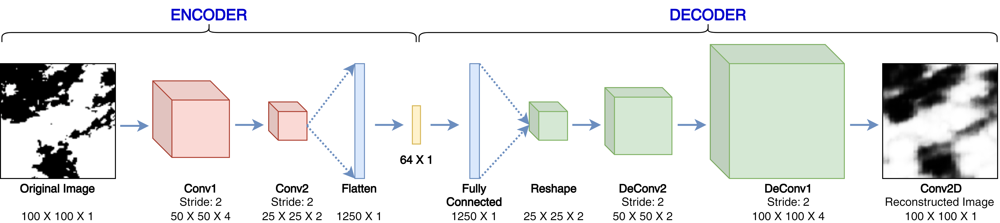

This work is an excerpt from the following manuscript:

>[M. Jain, C. Kumari, A. Kumar and S. Dev, "Using Meteosat Cloud Masks for Solar Irradiance Nowcasting," *2023 IEEE International Geoscience and Remote Sensing Symposium (IGARSS), Pasadena, CA, USA*, 2023, pp. 3938-3941.](https://doi.org/10.1109/IGARSS52108.2023.10283418)

# Encode Satellite-derived Cloud Masks
This component aims to encode the satellite-derived cloud masks by training an autoencoder and returning the latent space feature vectors from the trained model. The autoencoder architecture that is used in this work is depicted in the figure below.

   

## Core Scripts

In this enterprise, we utilize several core scripts to achieve the goals of our project. Here's a brief description of each of these essential scripts:

1. **`createEncodedData.py`**:
   - Create and save $64$-dimensional encoded representations for the downloaded and cropped ($100\times100$ pixel resolution) satellite-derived cloud masks - using the trained autoencoder.

2. **`imageAutoEnc.py`**:
    - Main script for data preparation, model definition, and training loop for the autoencoder
    - The model is implemented using the Tensorflow 2.0

3. **`rawDownloadToPNG.py`**:
    - Original EUMETSAT data is downloaded and saved in a `.zip` file for each available timestamp (refer [this](https://github.com/jain15mayank/eumetsat_python) repository for downloading EUMETSAT data).
    - This script parses those files and extract the $100\times100$ png image of the Cloud Masks around the location of interest from the `.grb` files present in the downloaded respective `.zip` files.

4. **`zip2npz.py`**:
    - Once the image files are retrieved from the `rawDownloadToPNG.py`, they were manually compressed into a `.zip` or `.tar.gz` file for each year.
    - This script converts the `.png` files for the entire year and save them as NumPy arrays.
    - Corresponding timestamps are also stored in the form of ordered lists in `.pkl` format.

5. **`ckptPlots2GIF.py`**:
   - Script to convert the original and reconstructed images, that were saved after every few epochs during the training process, into a GIF for better visulaization.