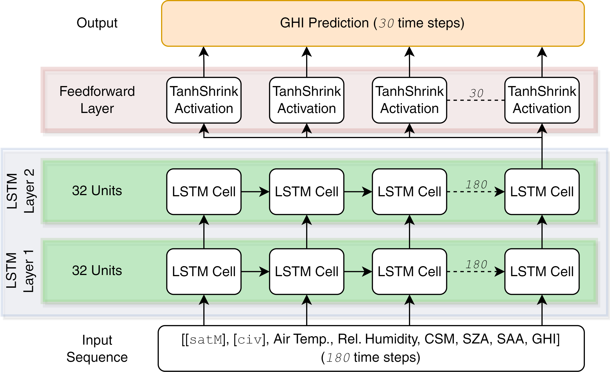

# GHI Forecasting Model
This component aims to utilize the encoded representation, of satellite-derived cloud masks and the GSI cloud images, as features alongside the relevant meteorological variables, historical GHI data, SZA, SAA, and CSM values to forecast GHI over a $60$- minute horizon.

LSTM-based model (shown in figure below) and PatchTST <a href="#ref1">[1]</a> were implemented to make GHI forecasts.

   

## Core Scripts

In this enterprise, we utilize several core scripts to achieve the goals of our project. Here's a brief description of each of these essential scripts:

1. **`script.py`**:
   - Main code file responsible for training the model.
   - Specifies the initialization arguments required for model training.

2. **`train.py`**:
   - Contains the training loop for the LSTM-based model that supports both single and multi-GPU execution.

3. **`trainPatchTS.py`**:
   - Contains the training loop for the PatchTST model that supports both single and multi-GPU execution.
   
4. **`evaluate.py`**:
   - This script plays a critical role in assessing the LSTM-based model's performance.
   - It calculates and provides the following evaluation metrics for every $10$-minute point forecasts (upto $60$ minutes) and for the continuous $60$-minute horizon:
     - Root Mean Square Error (RMSE)
     - Mean Absolute Error (MAE)
     - Coefficient of Determination ($R^2$)

5. **`evaluatePatchTS.py`**:
   - This script plays a critical role in assessing the PatchTST model's performance.
   - It calculates and provides the following evaluation metrics for every $10$-minute point forecasts (upto $60$ minutes) and for the continuous $60$-minute horizon:
     - Root Mean Square Error (RMSE)
     - Mean Absolute Error (MAE)
     - Coefficient of Determination ($R^2$)

6. **`datasets/createFinalData.py`**:
   - This script combines all the data from numerous components and collate them to create year-wise data files which will be accessed by the `datasets/TSforecastingDatasets.py` file.

7. **`datasets/TSforecastingDatasets.py`**:
   - It's responsible for creating the PyTorch dataset required for training and evaluation.

8. **`models/TSforecastingModels.py`**:
   - This script contains the PyTorch model, defining the architecture used in the project.
   - PatchTST code is reproduced from [this](https://github.com/yuqinie98/PatchTST) original GitHub repository <a href="#ref1">[1]</a>.

## References & Acknowledgement

1.  [Y. Nie, N. H. Nguyen, P. Sinthong and J. Kalagnanam, "A Time Series is Worth 64 Words: Long-term Forecasting with Transformers," *The Eleventh International Conference on Learning Representations (ICLR), Kigali, Rwanda*, 2023](https://openreview.net/forum?id=Jbdc0vTOcol)