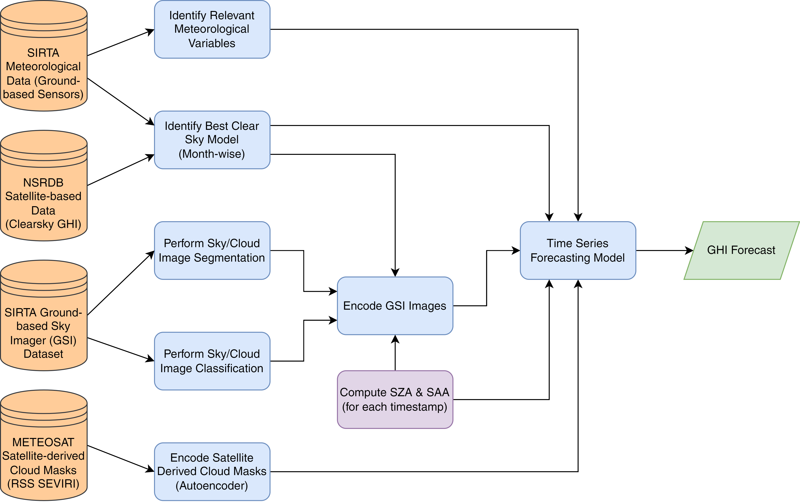

# Holistic and Lightweight Approach for Solar Irradiance Forecasting

With the spirit of reproducible research, this repository contains all the codes required to produce the results in the manuscript:

> M. Jain, P. Yadav and S. Dev, "Holistic and Lightweight Approach for Solar Irradiance Forecasting," in IEEE Transactions on Geoscience and Remote Sensing, 2023 [UNDER REVIEW].

---

## A Novel Framework for GHI Forecasting

This work introduces an innovative framework for global horizontal irradiance (GHI) forecasting. It leverages a combination of meteorological variables, historical GHI data, ground-based sky imager (GSI) images, and satellite-derived cloud masks. One of its key innovations lies in transforming complex image data into lower-dimensional feature vectors, enabling it to provide longer historical contexts for GHI forecasts, spanning a 60-minute horizon. The proposed framework is visually outlined below:

## Key Components of the Framework

1. **Identifying Relevant Meteorological Variables**
    - We employed diverse feature selection strategies to pinpoint the most critical meteorological variables <a href="#ref1">[1]</a>.
    - The corresponding code for this process is accessible in the directory named `1_Identify Met Vars`.

2. **Optimizing the Clear Sky Model (CSM)**
    - With a myriad of CSMs available in the literature, our objective was to identify the optimal one for a specific geographical location.
    - Recognizing that the optimality of CSM models can vary with time, we adopted a month-wise approach to select the best models <a href="#ref2">[2]</a>.
    - You can find the code related to this optimization in the `2_Identify CSM` directory.

3. **Sky/Cloud Image Segmentation**
    - In many cases, annotated sky/cloud images are not readily available for training the segmentation model for a given location. To address this, we applied a generative augmentation strategy to enhance the model's generalizability when dealing with out-of-distribution datasets <a href="#ref3">[3]</a>.
    - Once trained, the segmentation model was utilized to segment sky/cloud images for the specific location. These segmented images were then corrected for fisheye distortion, and cloud fraction values were calculated for each grid element after dividing the undistorted image into a $4\times4$ grid.
    - Detailed code for this process is located in the `3_Cloud Segmentation` directory.

4. **Sky/Cloud Image Classification**
    - Transfer learning techniques were employed to perform sky/cloud image classification using the SWIMCAT dataset <a href="#ref4">[4]</a>.
    - Similar to the segmentation component, the undistorted version of the original image was divided into a $4\times4$ grid, with each element classified into one of the five predefined classes.
    - Code relevant to this classification task can be found in the `4_Cloud Classification` directory.

5. **Encoding Satellite-derived Cloud Masks**
    - Satellite-derived cloud masks from the METEOSAT satellite are hereby encoded using an autoencoder to retain crucial information about cloud cover and movement <a href="#ref5">[5]</a>.
    - Code relevant to this encoding task can be found in the `5_SatMask Encode` directory.

6. **Encoding GSI Images**
    - Encoded feature vector or cloud impact vector ($\texttt{civ}$) is constructed from the cloud fraction and cloud classification vectors.
    - Solar zenith angle (SZA) and solar azimuth angle (SAA) were also considered in this step to righteously estimate the $\texttt{civ}$.
    - However, in the absence of suitable training data to directly achieve this transformation, a neural network architecture is designed to estimate GHI instead - which was then trained to extract $\texttt{civ}$ from the intermediate layer.
    - Details about this component and the code relevant to this task can be found in the `6_GSI Encode` directory.

7. **GHI Forecasting Model**
    - Finally, the relevant meteorological features, encoded satellite-derived cloud masks, encoded GSI images, historical GHI, SZA, SAA, and CSM values were used as features to forecast GHI over the next $60$-minute interval in this component.
    - More details and code relevant to this component can be found in the `7_GHI Forecasting` directory.

## References & Acknowledgement

1.  [M. Jain, N. Jain, N. Sinha and S. Dev, "A Systematic Spatio-Temporal Analysis of Relevant Meteorological Variables for Solar Irradiance Forecasting," *2023 IEEE International Geoscience and Remote Sensing Symposium (IGARSS), Pasadena, CA, USA*, 2023, pp. 1696-1699.](https://doi.org/10.1109/IGARSS52108.2023.10282834)
2.  [M. Jain, C. Kumari and S. Dev, "Identifying the Best Clear Sky Model for the Delhi-NCR Region," *2022 IEEE International Geoscience and Remote Sensing Symposium (IGARSS), Kuala Lumpur, Malaysia*, 2022, pp. 7926-7929.](https://doi.org/10.1109/IGARSS46834.2022.9883753)
3.  [A. Kumar, M. Jain and S. Dev, "Generative Augmentation for Sky/Cloud Image Segmentation," *2023 IEEE International Geoscience and Remote Sensing Symposium (IGARSS), Pasadena, CA, USA*, 2023, pp. 7288-7291.](https://doi.org/10.1109/IGARSS52108.2023.10283005)
4.  [M. Jain, N. Jain, Y. H. Lee, S. Winkler and S. Dev, "Transfer Learning for Cloud Image Classification," *2023 IEEE International Geoscience and Remote Sensing Symposium (IGARSS), Pasadena, CA, USA*, 2023, pp. 6005-6008.](https://doi.org/10.1109/IGARSS52108.2023.10281791)
5.  [M. Jain, C. Kumari, A. Kumar and S. Dev, "Using Meteosat Cloud Masks for Solar Irradiance Nowcasting," *2023 IEEE International Geoscience and Remote Sensing Symposium (IGARSS), Pasadena, CA, USA*, 2023, pp. 3938-3941.](https://doi.org/10.1109/IGARSS52108.2023.10283418)